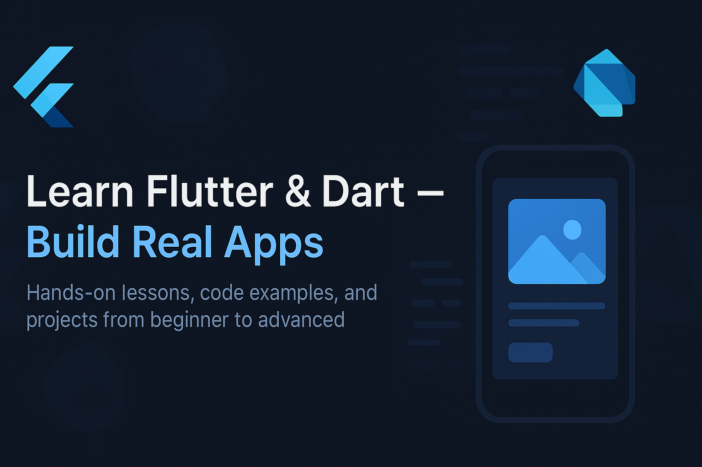

<p align="center">
  
</p>


## 📘 Overview
Welcome to **Learn Flutter & Dart Apps** — a community-driven learning path that helps you master Flutter and Dart by **building real-world apps**.

Each lesson includes:
- ✅ Simple explanations  
- 💻 Starter and solution code  
- 🧩 Exercises to practice  
- 🧠 Example projects to explore  

Whether you’re a **beginner** or moving toward **advanced app development**, this repo guides you step-by-step through everything you need.

---

## 🧭 Learning Roadmap

| Level | Lessons | Topics Covered |
|:------|:---------|:----------------|
| 🟢 **Beginner** | `00` – `09` | Dart basics, variables, functions, Flutter setup, widgets |
| 🟡 **Intermediate** | `10` – `19` | Navigation, forms, REST APIs, state management |
| 🔵 **Advanced** | `20` – `29` | Testing, Firebase, CI/CD, performance, publishing apps |

Each folder under `lessons/` is numbered and self-contained.

---

## ⚙️ Quick Start

```bash
# 1️⃣ Clone the repository
git clone https://github.com/<your-username>/learn-flutter-dart-apps.git

# 2️⃣ Open a lesson
cd learn-flutter-dart-apps/lessons/01-dart-basics/starter

# 3️⃣ Get dependencies
flutter pub get

# 4️⃣ Run the app
flutter run
